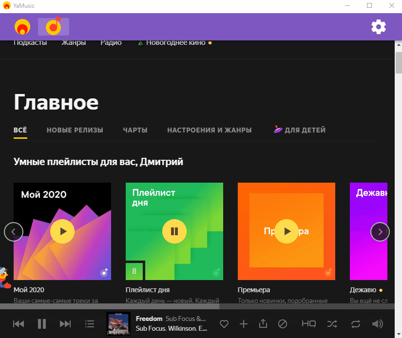

# Yandex Radio  and Yandex Music 

> Desktop app for [Yandex Radio](https://radio.yandex.ru/) and [Yandex Music](https://music.yandex.ru/).  
> Skips ads when is possible!  
> Ability to work through a proxy.  
> Thank you for choosing my app :relaxed:  
-----------------------------------------  
> Неофициальное декстопное приложение «Яндекс Радио» и «Яндекс Музыка» для всех платформ.   
> Работает через любой прокси.   
> Управление через медиа-кнопки.   
> Уведомления при смене трека.  
> По возможности блокирует рекламу.  
> Спасибо, что выбрали мое приложение :relaxed:  

 &nbsp;  


<p align="center">
	
</p>

---

## Installation
Choose a package that is suitable for your OS and install it.  

## Download  
|  Windows |  Linux | Mac  |
| ------------ | ------------ | ------------ |
| [Download - (**exe**)](https://github.com/dedpnd/yaradio-yamusic/releases/download/v1.0.0/YaMusic.app-Setup-1.0.0.exe)    | [Download - (**AppImage**)](https://github.com/dedpnd/yaradio-yamusic/releases/download/v1.0.0/YaMusic.app-1.0.0.AppImage) | [Download - (**dmg**)](https://github.com/dedpnd/yaradio-yamusic/releases/download/v1.0.0/YaMusic.app-1.0.0.dmg) |
|   | [Download - (**deb**)](https://github.com/dedpnd/yaradio-yamusic/releases/download/v1.0.0/yaradio-yamusic_1.0.0_amd64.deb) |   |


---

## Usage  
> Start app in dev mode
```
npm run electron:serve
```
> Build app 
```
npm run electron:build
```
---

## Documentation
Learn more about supporting [platforms](https://www.electron.build/)  

---

## Related
- [yaradio](https://github.com/maxvipon/yaradio) - Yandex.Radio Unofficial Desktop app  

---

## License

  

- **[MIT license](http://opensource.org/licenses/mit-license.php)**
- Copyright 2019-2021 © <a href="https://github.com/dedpnd" target="_blank">dedpnd</a>.
