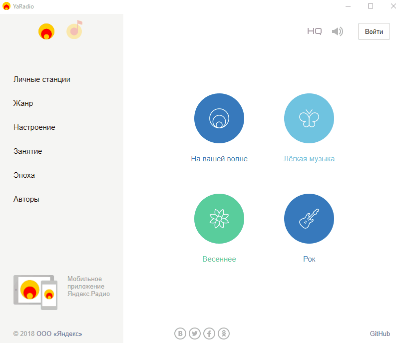

# Yandex Radio  and Yandex Music 

> Desktop app for [Yandex Radio](https://radio.yandex.ru/) and [Yandex Music](https://music.yandex.ru/).  
> Thank you for choosing my app :relaxed:  




---

## Installation
###### Windows & Linux 
Unpack the archive to any convenient location.  

###### Mac
Unpack the archive, move to the `/Applications` directory.  

---

## Download  
|  Windows |  Linux | Mac  |
| ------------ | ------------ | ------------ |
| [Download - **x64**](https://github.com/dedpnd/yaradio-yamusic/releases/download/latest/Yandex.Music.App-win32-x64.zip)    | [Download - **x64**](https://github.com/dedpnd/yaradio-yamusic/releases/download/latest/Yandex.Music.App-linux-x64.zip) | [Download - **x64**](https://github.com/dedpnd/yaradio-yamusic/releases/download/latest/Yandex.Music.App-darwin-x64.7z) |
| [Download - **ia32**](https://github.com/dedpnd/yaradio-yamusic/releases/download/latest/Yandex.Music.App-win32-ia32.zip)   | [Download - **ia32**](https://github.com/dedpnd/yaradio-yamusic/releases/download/latest/Yandex.Music.App-linux-ia32.zip) |   |
|   | [Download - **arm64**](https://github.com/dedpnd/yaradio-yamusic/releases/download/latest/Yandex.Music.App-linux-arm64.zip)  |   |
|   | [Download - **armv7l**](https://github.com/dedpnd/yaradio-yamusic/releases/download/latest/Yandex.Music.App-linux-armv7l.zip) |   | |

---

## Usage  
> Start app 
```
npm run start
```
> Start app by electromon  
```
npm run s:dev
```
> Build for all platform
```
npm run build:all
```
> Build for Windows
```
npm run build:win
```
> Build for Linux
```
npm run build:linux
```
> Build for Mac
```
npm run build:mac
```

---

## Documentation
Learn more about supporting [platforms](https://github.com/electron/electron/blob/master/docs/tutorial/support.md#supported-platforms)  

---

## Related
- [yam](https://github.com/artemeff/yam) - Yet Another Music Player / Yandex.Music Desktop Client  
- [yaradio](https://github.com/maxvipon/yaradio) - Yandex.Radio Unofficial Desktop app  

---

## License

  

- **[MIT license](http://opensource.org/licenses/mit-license.php)**
- Copyright 2019 © <a href="https://github.com/dedpnd" target="_blank">dedpnd</a>.
